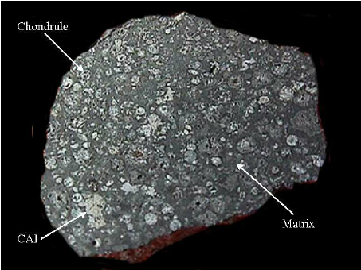

# The Allende Meteorite

## error[37,40]

Sometime after midnight on February 8, 1969, a large, bright `meteor` entered Earth’s atmosphere and broke into thousands of pieces, `plummeted` to the ground, and scattered over an area 50 miles long and 10 miles wide in the state of Chihuahua in Mexico. The first meteorite from this fall was found in the village of Pueblito de Allende. Altogether, roughly two tons of `meteorite` fragments were recovered, all of which `bear the name` Allende for the location of the first discovery.

> plummet vi. 暴跌，速降
>
> meteor 流星
>
> meteorite `[ˈmiːtiəraɪt]`陨石
>
> bear the name 有（某个名称）

Individual specimens of Allende are covered with a black, glassy `crust` that formed when their exteriors `melted` as they were slowed by Earth’s atmosphere. When broken open, Allende stones are revealed to contain `an assortment of` small, distinctive objects, spherical or irregular in shape and embedded in a dark gray matrix (binding material), which were once constituents of the solar nebula——the `interstellar` cloud of gas and dust out of which our solar system was formed.

> crust 硬壳
>
> an assortment of 各种各样的
>
> constituent [c]成分
>
> interstellar 星际的
>
> Out solar system was formed out of could of gas and dust.
>
> 我们的太阳系是用气体云和尘埃生成的。

The Allende meteorite is classified as a chondrite. Chondrites take their name from the Greek word chondros——meaning "seed"——an `allusion` to their appearance as rocks containing tiny seeds. These seeds are actually chondrules: `millimeter`-sized melted droplets of `silicate` material that were cooled into spheres of glass and crystal. **A few chondrules contain grains that survived the melting event, so these enigmatic chondrules must have formed when `compact` masses of nebular dust were fused at high temperatures——approaching 1,700 degrees Celsius——and then cooled before these surviving grains could melt.** Study of the `textures` of chondrules confirms that they cooled rather quickly, in times measured in minutes or hours, so the heating events that formed them must have been localized. It seems very unlikely that large portions of the nebula were heated to such extreme temperatures, and huge nebula areas could not possibly have lost heat so fast. Chondrules must have been melted in small pockets of the nebula that were able to lose heat rapidly. The origin of these peculiar glassy spheres remains an enigma.

Allend 被分为chondrite。意为种子，融化的硅物质液滴在球形玻璃中冷却。一些C包含没有融化的颗粒。所以这些神秘的c必须在星云尘埃高温融化并且在剩下的颗粒未融化之前冷却的时候形成。星云局部加热到很高的温度，然后降温形成了中间带颗粒的Chondrites（粒状陨石）。

> allusion ：something that is said or written that refers to or mentions another person or subject in an indirect way.
>
> millimeter 毫米
>
> silicate 硅酸盐
>
> compact 小型的
>
> texture 质地，手感
>
> localized 局部的

 Equally perplexing constituents of Allende are the refractory `inclusions`: irregular white masses that tend to be larger than chondrules. They are composed of minerals uncommon on Earth, all rich in calcium, aluminum, and titanium, the most refractory (resistant to melting) of the major elements in the nebula. The same minerals that occur in refractory inclusions are believed to be the earliest-formed substances to have `condensed` out of the solar nebula. However, studies of the textures of inclusions reveal that the order in which the minerals appeared in the inclusions varies from inclusion to inclusion, and often does not match the theoretical condensation sequence for those metals.

1\. 

> refractory 难以驾驭的
>
> inclusion 被包括的人或事物
>
> refractory inclusion 耐火材料夹杂物
>
> condense [vt,vi]凝结
>
> 

Chondrules and inclusions in Allende are held together by the chondrite matrix, a mixture of fine-grained, mostly silicate minerals that also includes grains of iron metal and iron sulfide. At one time it was thought that these matrix grains might be `pristine` nebular dust, the sort of stuff from which chondrules and inclusions were made. However, detailed studies of the chondrite matrix suggest that much of it, too, has been formed by condensation or melting in the nebula, although minute amounts of surviving interstellar dust are mixed with the processed materials.

> pristine adj. fresh and clean = pure

All these diverse constituents are aggregated together to form chondritic meteorites, like Allende, that have chemical compositions much like that of the Sun. To compare the compositions of a meteorite and the Sun, it is necessary that we use ratios of elements rather than simply the abundances of atoms. After all, the Sun has many more atoms of any element, say iron, than does a meteorite specimen, but the ratios of iron to silicon in the two kinds of matter might be comparable. The compositional similarity is striking. The major difference is that Allende is depleted in the most volatile elements, like hydrogen, carbon, oxygen, nitrogen, and the noble gases, relative to the Sun. These are the elements that tend to form gases even at very low temperatures. We might think of chondrites as samples of distilled Sun, a sort of solar sludge from which only gases have been removed. Since practically all the solar system’s mass resides in the Sun, this similarity in chemistry means that chondrites have average solar system composition, except for the most volatile elements; they are truly lumps of nebular matter, probably similar in composition to the matter from which planets were assembled.