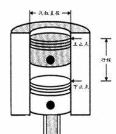
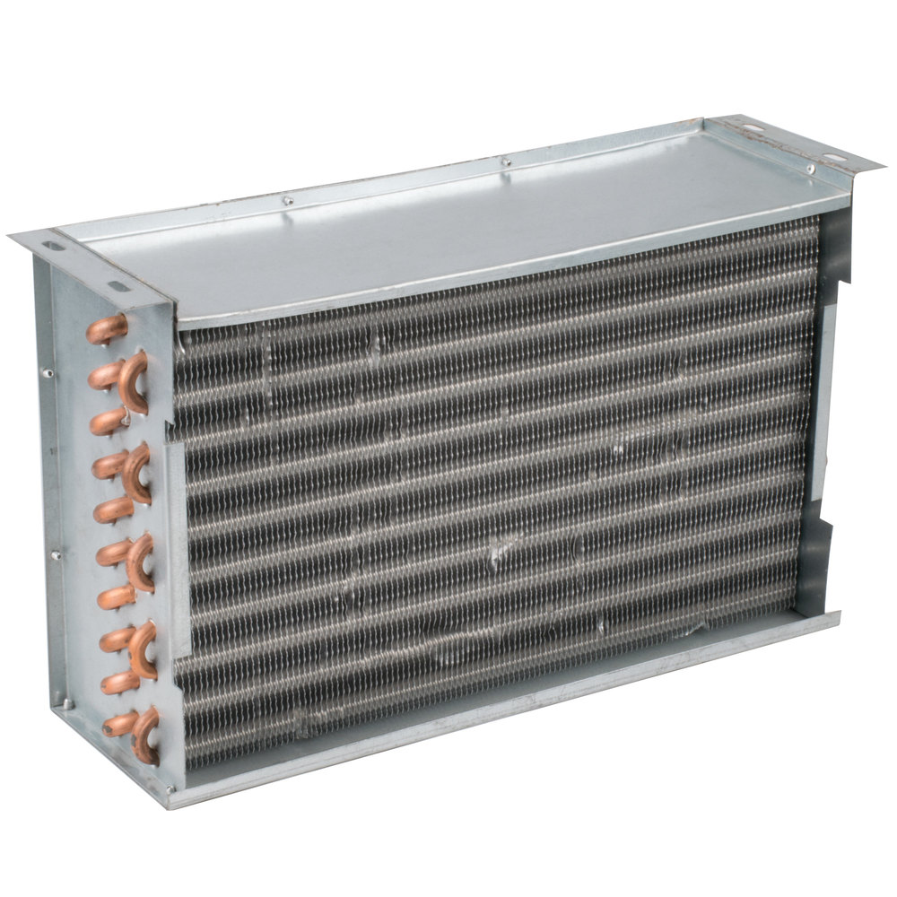

#Powering the Industrial Revolution
In Britain one of the most dramatic changes of the Industrial Revolution was the harnessing of power. Until the reign of George ?(1760-1820), available sources of power for work and travel had not increased since the Middle Ages. There were three sources of power: animal or human muscles; the wind, operating on sail or windmill; and running water. "Only the last of these was suited at all to the continuous `operating` of machines, and although waterpower abounded in Lancashire and Scotland and ran `grain` mills as well as textile mills, it had one great disadvantage: streams flowed where nature intended them to, and water-driven factories had to be located on their banks whether or not the location was desirable for other reasons. " Furthermore, even the most reliable waterpower varied with the seasons and disappeared in a drought. The new age of machinery, in short, could not have been born without a new source of both movable and constant power.  
&emsp;&emsp;在英国，工业革命最重大的改变之一就是能源的应用。为工作和旅行提供的可用的能源来源自从中世纪以来就没有增加。有三种能源：动物或人力；推动航行和风车的风；还有流水。只有最后一个（流水）才适合持续运转的机器，并且水染水里在Lancashire和苏格兰非常丰富并且驱动谷物工厂和纺织厂，它还是有一个大缺点：水流流向依靠自然决定，无论其他因数需要，水动力工厂必须建在岸边。而且，即使最可靠的水源也会随季节变化，最后枯竭。总之，机器的时代不可能出现要是没有一种新的可移动的和恒定的能源。  
> operate `[ˈɑːpəreɪt]`  
> vi. to work in a particular way 运转  
> Most dometic freezers operate at below -18˚C。  

> bank  
> n. 岸；河畔。

> abound 大量的  
> widely avaliable 普遍可获得的

The source had long been known but not "exploited". Early in the eighteenth century, a pump had `come into use` in which expanding steam raised a `piston` in a `cylinder`, and atmospheric pressure brought it down again when the steam condensed inside the cylinder to form a `vacuum`. This ""atmospheric engine"," invented by Thomas Savery and vastly improved by his partner, Thomas Newcomen, embodied revolutionary principles, but it was so slow and wasteful of fuel that it could not be employed outside the coal mines for which it had been designed. In the 1760s, James Watt perfected a separate `condenser` for the steam, so that the cylinder did not have to be cooled at every stroke; then he devised a way to make the piston turn a wheel and thus convert reciprocating (back and forth) motion into rotary motion. He thereby transformed an inefficient pump of limited use into a steam engine of a thousand uses. The final step came when steam was `introduced` into the cylinder to drive the piston backward as well as forward, thereby increasing the speed of the engine and cutting its fuel consumption.  
&emsp;&emsp;很久以前，这种资源就被发现，但没有被利用。18世纪早期，一种泵已经开始使用，膨胀的蒸汽抬起一个在圆柱体内的活塞，并且大气压使他再次下降，当蒸汽在圆柱体中压缩形成真空。这种“自动引擎”体现了革命法则，由托马斯·赛佛瑞发明，之后被他的搭档托马斯·纽凯门改进。但是这种机器非常慢而且浪费燃料，以至于它不能应用于煤矿之外的地方，它本来就是为了煤矿设计的。在18世纪60年代，詹姆斯瓦特未蒸汽机优化了分离式冷凝器，因此气缸不用每次敲击都要冷却；之后他发明了一种方法使得活塞转圈，因此将往复运动改为旋转运动。 因此他把特定用法的低效泵改造成多用途的蒸汽引擎。 最后一步完成当蒸汽被引入活塞来驱动活塞向后和它向前一样，因此提高速度减少燃油消耗。  
3s: watt 改进蒸汽机，由三个方面。
> come to/into 达到，进入（某种状态）  
> come into use 进入使用状态 = 开始使用  
> piston  `['pɪstən]` 活塞。  
  
> cylinder `['sɪlɪndər]`  
> 气缸  
> condenser  
> 冷凝器  
>   
> introduce sth (into sth) 将。。。放进  
> Watt introduced steam into cylinders to drive the piston backward as well as forward.  

Watt's steam engine soon showed what it could do. It liberated industry from dependence on running water. The engine eliminated water in the mines by driving efficient pumps, which made possible deeper and deeper mining. The `ready` availability of coal inspired William Murdoch during the 1790s to develop the first new form of nighttime illumination to be discovered in a `millennium` and a half. Coal gas `rivaled` smoky oil lamps and flickering candles, and early in the new century, well-to-do Londoners "grew accustomed to" gaslit houses and even streets. Iron manufacturers, which had starved for fuel while depending on charcoal, also benefited from ever-increasing supplies of coal: `blast` furnaces with steam-powered bellows turned out more iron and steel for the new machinery. Steam became the motive force of the Industrial Revolution as coal and iron `ore` were the raw materials.  
&emsp;&emsp;瓦特的蒸汽机很快展现他能做的事。它将工业从对水的依赖中解放出来。引擎通过高效泵在矿中排出水，使得矿越挖越深。在18世纪90年代，易获得的煤启发了威廉姆·蒙太奇发明了新的夜间照明装置。煤气与煤油灯和蜡烛相匹敌，在新世纪早期，富裕的伦敦人逐渐适应广泛使用煤气灯的房子甚至使街道。当钢铁冶炼厂依赖于木炭时，他们缺乏燃料。他们也从煤炭供应增长中获益。  
> ready adj. 方便实用的，现成的  
> millennium n. 一千年  
> rival v. 比得上，与。。。相匹敌。  
> well-to-do 富裕的  
> ore n. 矿石
> indicate one of the important developments made possible by the introduction of Watt's steam engine  
> 指出一项重要的发明，由于瓦特蒸汽机的使用成为可能。

By 1800 more than a thousand steam engines were in use in the British Isles, and Britain "retained" a virtual monopoly on steam engine production until the 1830s. Steam power did not merely `spin cotton and roll iron`; early in the new century, it also multiplied ten times over the amount of paper that a single worker could produce in a day. At the same time, operators of the first printing presses run by steam rather than by hand found it possible to produce a thousand pages in an hour rather than thirty. **[1]Steam also promised to eliminate a transportation problem not fully solved by either canal boats or turnpikes.** Boats could carry heavy weights, but canals could not cross hilly terrain; turnpikes could cross the hills, but the roadbeds could not stand up under great weights. These problems needed still another solution, and the ingredients for it lay close at hand. In some industrial regions, heavily laden wagons, with flanged wheels, were being hauled by horses along metal rails; and the stationary steam engine was puffing in the factory and mine. **[2]Another generation passed before inventors succeeded in combining these `ingredients`, by putting the engine on wheels and the wheels on the rails, so as to provide a machine to take the place of the horse.** Thus the railroad age sprang from what had already happened in the eighteenth century.  
> promise vt.使很可能  
> [1]运输问题没有被运河渡船解决，蒸汽很可能解决运输问题。  
> so as to do sth 为了做某事  
> ingredient  
> [c] 要素  
> so as to do sth.  
> 为了做某事，以便做某事  
> [2] 为了用机器替换马匹，发明家们将蒸汽机放在轮子上，并把轮子放在铁路上。在发明家将这些要素成功合成之前，又一代人过去了。  
