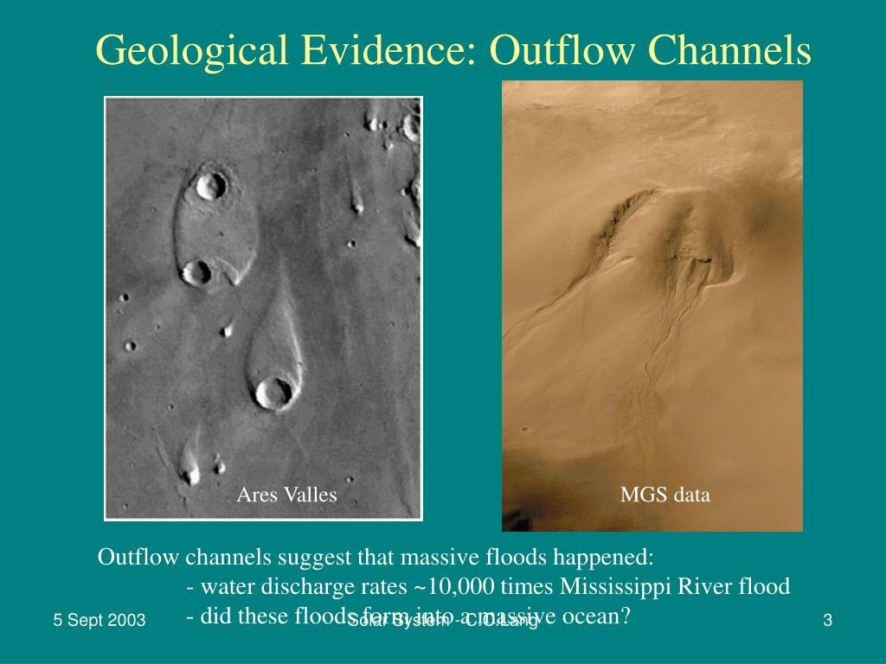

# Running Water on Mars
## 火星上的流水

Photographic evidence suggests that liquid water once existed in great quantity on the surface of Mars. Two types of **flow features** are seen: runoff channels and outflow channels. Runoff channels are found in the southern highlands. These flow features are **extensive systems**-sometimes hundreds of kilometers in total length-of interconnecting, twisting channels that seem to merge into larger, wider channels. They bear a strong `resemblance` to river systems on Earth, and geologists think that they are dried-up beds of long-gone rivers that once carried rainfall on Mars from the mountains down into the valleys. Runoff channels on Mars speak of a time 4 billion years ago (the age of the Martian highlands), when the atmosphere was thicker, the surface warmer, and liquid water widespread.
1、液态水曾经在火星大量存在。2、两种流特征；3、地表径流在南高地找到；4、extensive system；5、与地球河流类似并且干涸；6、存在于四千年前。  
> bear a resemblance to sth/sb  
> 与。。。相类似  

Outflow channels are probably `relics` of catastrophic flooding on Mars long ago. They appear only in equatorial regions and generally do not form extensive interconnected networks. **Instead, they are probably the paths taken by huge volumes of water draining from the southern highlands into the northern plains.** The onrushing water arising from these 'flash' floods likely also formed the odd teardrop-shaped "islands" (resembling the miniature versions seen in the wet sand of our beaches at low tide) that have been found on the plains close to the ends of the outflow channels. Judging from the width and depth of the channels, the flow rates must have been truly enormous-perhaps as much as a hundred times greater than the 105 tons per second carried by the great Amazon river. Flooding shaped the outflow channels approximately 3 billion years ago, about the same times as the northern volcanic plains formed.  
1、外流河道是天体洪水的遗迹。2、只在赤道+没有交错的网络。3、4、5、流量很大。6、形成早和北部火山一起形成。
> relic  
> 遗迹  
> equatorial [.ekwə'tɔriəl]  
> 赤道的  
> equator for noun  
> flash flood 暴洪

